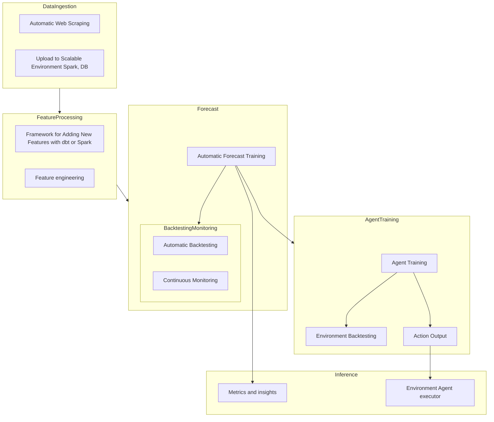
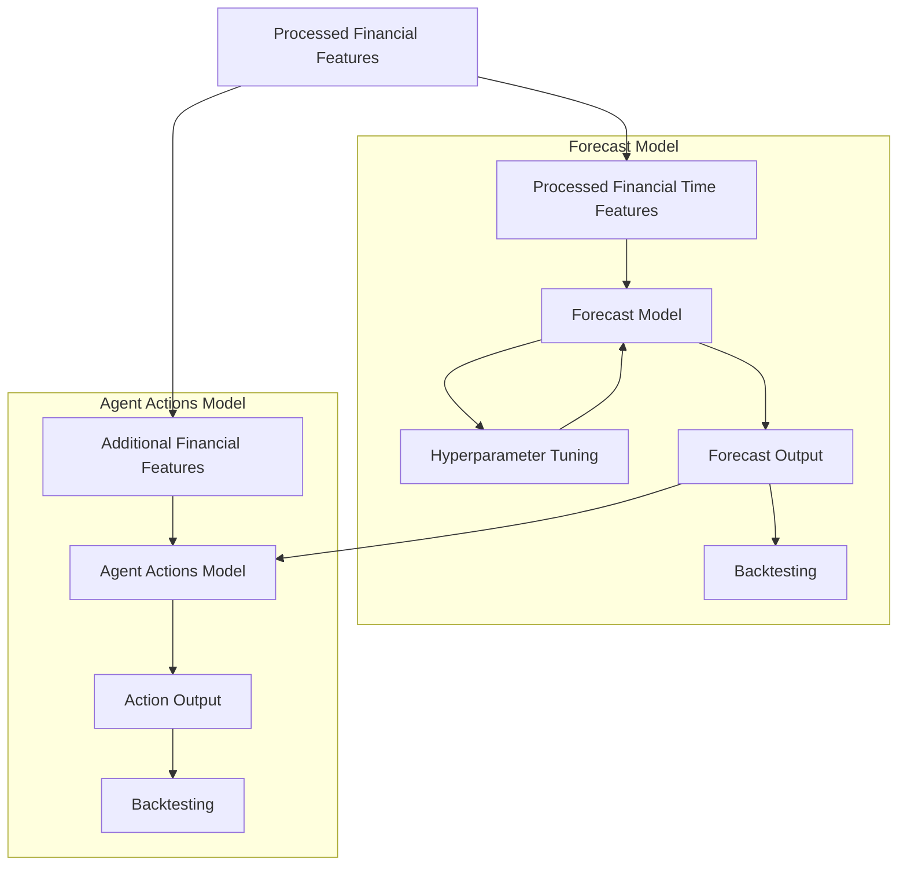

# Creating an Automatic Forex Trading Pipeline using Machine Learning

## Index

1. [Summary and Research Question](#summary-and-research-question)
2. [Architecture Diagrams](#architecture-diagrams)
    - [High-level architecture diagram](#high-level-architecture-diagram)
    - [Model architecture diagram](#model-architecture-diagram)
3. [Project Objectives](#project-objectives)
    - [Abstract Summary](#abstract-summary)
    - [1. Automatic Web Scraping and Data Ingestion](#1-automatic-web-scraping-and-data-ingestion)
    - [2. Automatic Feature Processing, Framework for Adding New Features](#2-automatic-feature-processing-framework-for-adding-new-features)
    - [3. Feature Engineering with the Data](#3-feature-engineering-with-the-data)
    - [4. Automatic Forecast Training](#4-automatic-forecast-training)
    - [5. Automatic Backtesting and Monitoring](#5-automatic-backtesting-and-monitoring)
    - [6. Agent Training and Analysis](#6-agent-training-and-analysis)
    - [7. Scalable Inference](#7-scalable-inference)
4. [Requirements](#requirements)
    - [Technical Requirements](#technical-requirements)
    - [Functional Requirements](#functional-requirements)
5. [Methodology](#methodology)
6. [Timeline](#timeline)

## Summary and Research Question

In the current financial landscape, the automation of investment strategies has become essential for capitalizing on opportunities in the foreign exchange market. This project aims to design and implement a complete pipeline to facilitate data ingestion, forecasting and inference of various financial metrics.

## Architecture diagrams

### High-level architecture diagram

### Model architecture diagram

## Project Objectives

### **Abstract Summary:**
The project revolves around three main targets: **Data Ingestion and processing**, which involves automating web scraping and ingesting data into a scalable environment; **Machine Learning-based Forecasting**, which includes automatic feature processing, feature engineering, and training forecasting models; and **Machine Learning-based Agent**, which encompasses backtesting, continuous monitoring, and the execution of scalable trading agents.

### 1. Automatic Web Scraping and Data Ingestion

#### Description:
Automate the process of collecting financial data from various online sources. This involves setting up web scraping tools to extract data in real-time or at scheduled intervals. The collected data will be ingested into a scalable environment, providing a continuous flow of up-to-date information for analysis.

#### Implementation:
Utilize Python-based web scraping libraries (e.g., BeautifulSoup, Scrapy) to extract data from financial websites and download any finance dataset(Yahoo, Google or Oanda). Implement a data ingestion pipeline that automatically loads the raw ingested data into a scalable environment, such as a distributed database or Apache Spark.

### 2. Automatic Feature Processing, Framework for Adding New Features

#### Description:
Automate the preprocessing of features extracted from financial data. Additionally, create a flexible framework that allows for the seamless integration of new features.

#### Implementation:
Develop automated feature processing modules using libraries like Pandas and NumPy(With compatibility with Spark or other scalable framework such as dbt). Modules should be sufficiently efficent and simple to allow users to configure feature processing steps and incorporate new features without extensive code modifications.

### 3. Feature Engineering with the Data

#### Description:
Enhance the quality and relevance of features by applying feature engineering techniques.

#### Implementation:
Once the framework is done create engineer features such as lag features, rolling statistics, and technical indicators (e.g., moving averages, relative strength index, splines) to the financial data. Experiment with different transformations to create features that capture relevant patterns and trends.

### 4. Automatic Forecast Training

#### Description:
Implement an automated machine learning pipeline to train forecasting models based on historical financial data.

#### Implementation:
Utilize machine scikit-learn for base methods and XGBoost, TensorFlow to build forecasting models. Implement automation for model training, hyperparameter tuning (with already known algorithms such as Optuna), and model evaluation.

### 5. Automatic Backtesting and Monitoring

#### Description and Implementation:
Develop a backtesting trading environment to assess the performance of forecasting models using historical data. Implement continuous monitoring to evaluate model accuracy over time and detect potential degradation in performance.

### 6. Agent Training and Analysis

#### Description and Implementation:
Train the trading agent implementing a simple Deep Q-Network (DQN) and using other industry methods such as Proximal Policy Optimization (PPO). Conduct a comprehensive analysis to evaluate the performance of both methods.

### 7. Scalable Inference

#### Description:
Enable the deployment of forecasting models in a scalable inference environment. Implement an execution framework for trading agents that can make real-time decisions based on model predictions.

#### Implementation:
Develop an execution framework that allows trading agents to act on the forecasted signals using Oanda API or a dummy API. Ensure the system can handle real-time-like data and execute trades efficiently.

---

## Requirements

### Technical Requirements

- **Programming Language:** Python
- **Data Sources:** Establish connections to real-time-like financial data sources.
- **Scalable Environment:** Utilize scalable infrastructure for efficient data ingestion and processing.
- **Machine Learning Algorithms:** Implement algorithms for forecasting and agent training.

### Functional Requirements

1. **Customizable Input Strategies:**
   - Allow users to define and customize input strategies and insights for forecasting models and trading agents.

2. **Pipeline Orchestration:**
   - Operate pipelines through a user-friendly UI orchestrator such as Dagster or Airflow to facilitate management and monitoring.

3. **Data Visualization:**
   - Provide interactive visualization of finance data and key metrics to aid in understanding and decision-making.

5. **Alerting System:**
   - Integrate an alerting system to notify users of significant events, changes in model performance, or potential issues that require attention.

7. **Experimentation, Documentation and Training Materials:**
   - Provide thorough documentation and analysis on the performance of the pipeline, algorithms and its components.

## Methodology

1. **Literature Review:** Review of literature on finance and algorithmic investment strategies.
2. **Pipeline Design:** Definition of architecture, modules, and data flows. This includes definition of orchestration tools, scope of features customization, and scalability.
3. **Development:** Implementation of the pipeline and its components as a basis for experimentation.
4. **Experimentation and refinement:** Verification of performance, robustness, and effectiveness of the models and pipeline. Refinement of the features and algorithms.
5. **Evaluation:** Analysis of results and comparison with conventional investment strategies as well as a functional description of the product.

## Timeline

- **Phase 1 (Month 1~):** Literature review and pipeline definition.
- **Phase 2 (Month 1-3):** Development and implementation of the pipeline.
- **Phase 3 (Month 4):** Experimentation and refinement.
- **Phase 4 (Month 5-6):** Documentation and analysis of results.